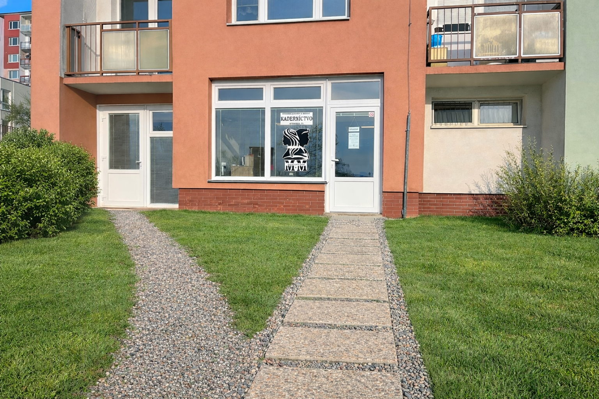

<!DOCTYPE html>
<html lang="sk">
<head>
  <meta charset="UTF-8" />
  <meta name="viewport" content="width=device-width, initial-scale=1.0"/>
  <title>M&M Kaderníctvo</title>

  
</head>

<body>

  <!-- TOPBAR -->
  

    

      

        

          

            
          

          

            <h1>M&M KADERNÍCTVO</h1>
            <small>„Štýl pre ženy, mužov a deti“</small>
          

        

        <nav>
          <a href="#sluzby">Služby</a>
          <a href="#tim">Náš tím</a>
          <a href="#cennik">Cenník</a>
          <a href="#galeria">Galéria</a>
          <a href="#kontakt">Kontakt</a>
          <a href="#onas">O nás</a>
        </nav>

      

    

  

  <!-- HERO -->
  

    

      

        

          <h2>Štýl, ktorý sadne hneď na prvý pohľad</h2>
          

            V M&M Kaderníctve kladieme dôraz na detail, čistotu, profesionalitu a individuálny prístup.
            Príď si po zmenu, ktorá ti bude sedieť.
          

          

            
Dámske strihanie

            
Pánske strihanie

            
Detské strihanie

            
Farbenie

            
Umývanie vlasov

            
Sušenie vlasov

            
Melír

            
Styling

            
Spoločenské účesy

            
Úprava brady

            
...

          

        

        <!-- RÝCHLE INFO -->
        

          <h3>Rýchle info</h3>
          

            
<b>📍 Adresa:</b> Aténska 25, Košice

            
<b>🕒 Otváracie hodiny:</b> Podľa objednávok

            
<b>📞 Telefón:</b> Melinda Pavlíková: 0908 985 971

            
<b>📞 Telefón:</b> Marcela Tkáčová: 0950 749 145

          

          

            Rezervácia odporúčaná – termíny sa rýchlo míňajú.
          

        

      

    

  

  <!-- SLUŽBY -->
  <section id="sluzby">
    

      <h3 class="section-title">Služby</h3>

      

        

          <b>Dámske</b>
          <ul class="list">
            <li>Dámsky strih</li>
            <li>Fúkaná &amp; styling</li>
            <li>Umývanie vlasov</li>
            <li>Spoločenské účesy</li>
          </ul>
        

        

          <b>Pánske</b>
          <ul class="list">
            <li>Pánsky strih</li>
            <li>Fade / kontúry</li>
            <li>Úprava brady</li>
          </ul>
        

        

          <b>Farbenie</b>
          <ul class="list">
            <li>Farbenie / tónovanie</li>
            <li>Melír / balayage</li>
            <li>Preliv</li>
            <li>Farbenie vlastnou farbou</li>
          </ul>
        

      

    

  </section>

  <!-- NÁŠ TÍM -->
  <section id="tim">
    

      <h3 class="section-title">Náš tím</h3>

      

        

          <b>Kaderníčka Melinda</b>
          
„Meli“

          

            - práca kaderníčky sa jej zapáčila hneď po škole 
            - roky praxe a skúseností 
            - táto práca ju robí šťastnou
          

        

        

          <b>Kaderníčka Marcela</b>
          
„Marcelka“

          

            - profíčka s bohatými skúsenosťami 
            - zákazníkom vždy poradí s úsmevom na tvári najlepšie ako vie
          

        

        

          <b>Objednávky</b>
          

            Objednávať sa môžete telefonicky, SMS správou alebo priamo v kaderníctve.
          

        

      

    

  </section>

  <!-- CENNÍK -->
  <section id="cennik">
    

      <h3 class="section-title">Cenník (orientačne)</h3>

      

        

          Dámsky strih <b style="color:var(--text);">od 10–13 €</b>
        

        

          Pánsky strih <b style="color:var(--text);">od 9–13 €</b>
        

        

          Farbenie <b style="color:var(--text);">od 17–28 €</b>
        

        

          Styling / fúkaná <b style="color:var(--text);">od 22–32 €</b>
        

        

          Ceny sa môžu líšiť podľa dĺžky vlasov a náročnosti úprav.
        

      

    

  </section>

  <!-- GALÉRIA -->
  <section id="galeria">
    

      <h3 class="section-title">Galéria</h3>

      

        

          
        

        

          
        

        

          
        

      

    

  </section>

  <!-- KONTAKT -->
  <section id="kontakt">
    

      <h3 class="section-title">Kontakt</h3>

      

        

          
<b>📍 Adresa:</b> Aténska 25, Košice

          
<b>📞 Telefón:</b> Melinda Pavlíková: 0908 985 971

          
<b>📞 Telefón:</b> Marcela Tkáčová: 0950 749 145

          
<b>🕒 Otváracie hodiny:</b> Podľa objednávok

          
<b>🌐 Instagram a Facebook:</b> @mm.kadernictvo

        

        

          <b>Mapa:</b>
          <iframe
            src="https://www.google.com/maps/embed?pb=!1m18!1m12!1m3!1d657.5394570486503!2d21.261048615971735!3d48.759782232396084!2m3!1f0!2f0!3f0!3m2!1i1024!2i768!4f13.1!3m3!1m2!1s0x473ee100711fd923%3A0xd6a18fa7870f651b!2sKadern%C3%ADctvo%20M%26M!5e0!3m2!1ssk!2ssk!4v1769975428526!5m2!1ssk!2ssk"
            width="100%"
            height="260"
            style="border:0; border-radius:12px;"
            allowfullscreen=""
            loading="lazy"
            referrerpolicy="no-referrer-when-downgrade">
          </iframe>
        

      

    

  </section>

  <!-- O NÁS (POD KONTAKTOM) -->
  <section id="onas">
    

      <h3 class="section-title">O nás</h3>

      

        

          
<b>Sme novootvorené kaderníctvo, ktoré začalo fungovať začiatkom roka 2026.</b>

          

            Prečo M&amp;M? Tento názov vznikol z iniciálov našich mien – Melinda a Marcela. 
            Dostanete sa k nám jednoducho, keďže sa nachádzame neďaleko konečnej autobusovej zastávky
            a parkovanie je možné priamo pred kaderníctvom.
          

        

      

    

  </section>

  <!-- ČIERNY BOX ÚPLNE NA KONCI (PRED ROKOM) -->
  

    Zarezervujte si svoj termín včas a my ťa radi privítame v našom kaderníctve M&amp;M
  

  

    © 2026 M&amp;M Kaderníctvo
  

</body>
</html>

